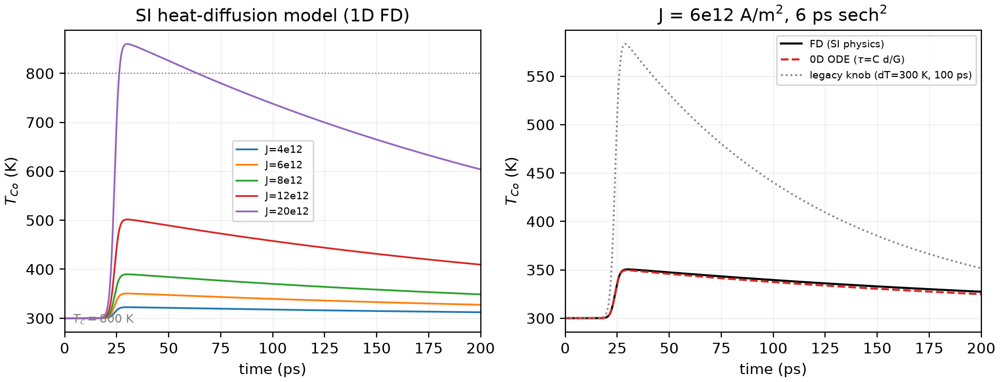
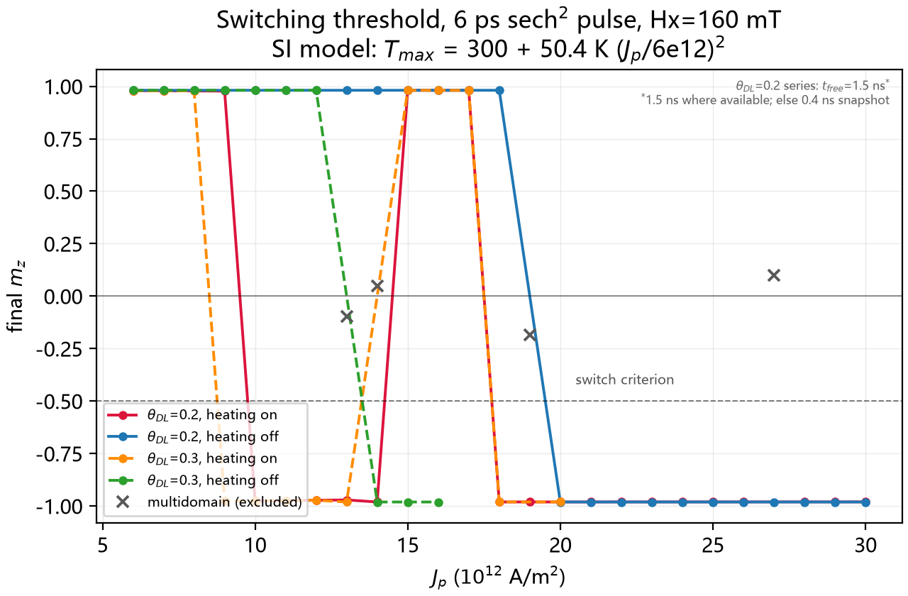
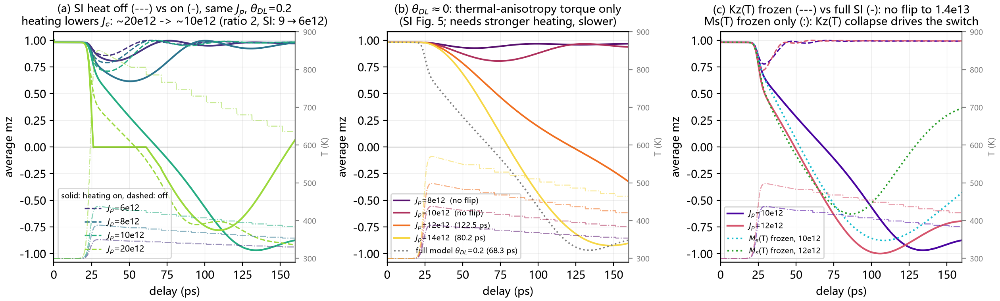
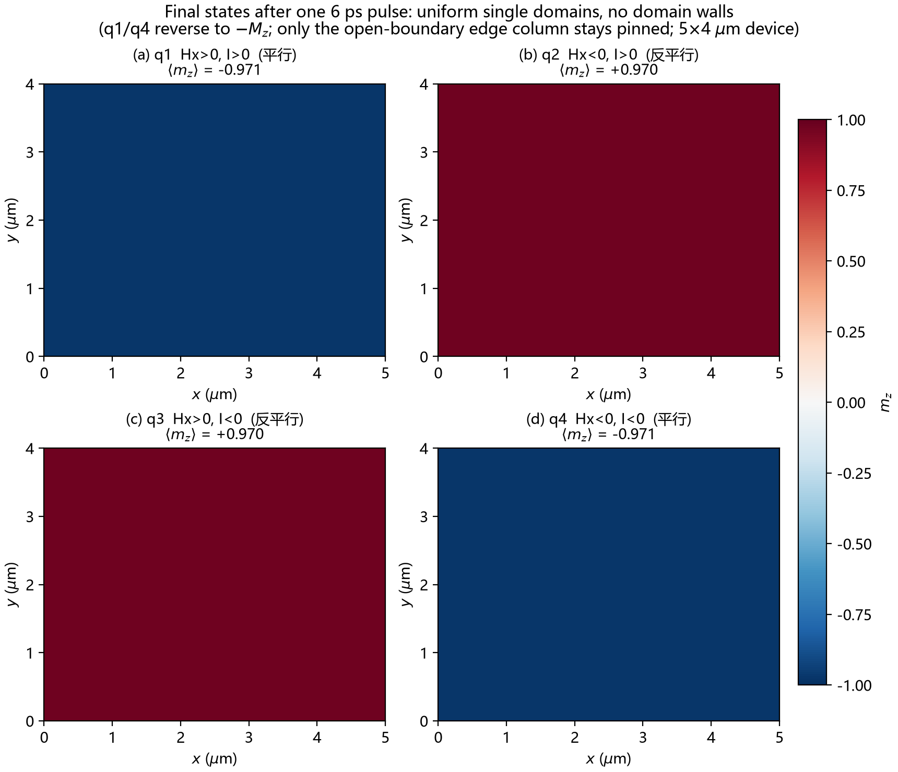
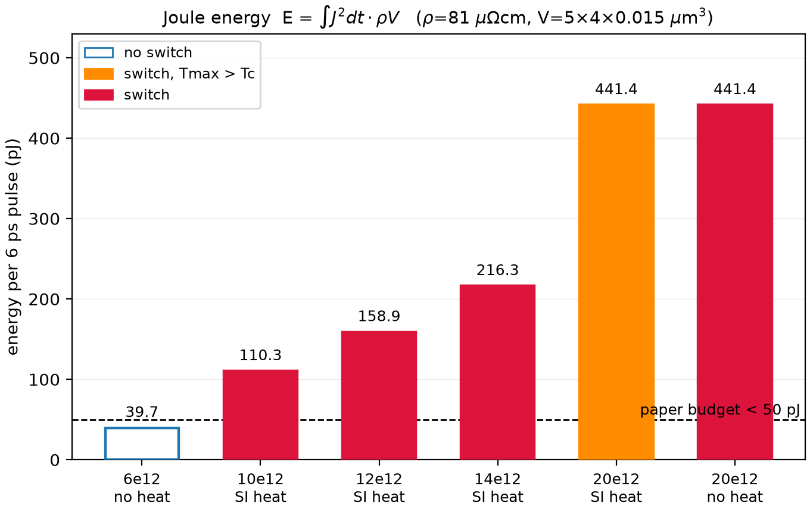

# PicoSOT

English | [简体中文](README.zh-CN.md)

**mumax3 replica: spin-orbit torque switching with picosecond electrical pulses (SI-parameter model)**


A [mumax3](https://mumax.github.io/) replica of:

> K. Jhuria, J. Hohlfeld, ... J. Gorchon,
> **"Spin-orbit torque switching of a ferromagnet with picosecond electrical pulses"**,
> *Nature Electronics* **3**, 680-686 (2020).
> doi: [10.1038/s41928-020-00488-3](https://doi.org/10.1038/s41928-020-00488-3)

**Status (2026-09-16):** the material and thermal model now follows the paper's
Supplementary Information item by item (SI Note 3 + Table S1, see
[`docs/si_replica.md`](docs/si_replica.md)): Ms(300 K)=1.0×10⁶ A/m, B<sub>K</sub>=0.8 T,
alpha=0.23, Ms(T)=Ms(0)[1−(T/Tc)^1.7], Kz(T)∝Ms³, and heating as the 0D equivalent
channel of the SI heat-diffusion model (6×10¹² / 6 ps → peak +50.4 K, τ=245 ps).
The older runs (guessed parameters, free dT<sub>ref</sub> knob) are kept as `model=legacy`
in `runs/summary.csv` and `runs/legacy/` (local only — run data is not committed,
see §6).

## Results at a glance

|  |  |
|---|---|
| **Thermal model**: SI 1D FD vs the 0D .mx3 channel (`heat_model.py`) | **Threshold map**: mz<sub>final</sub> vs Jp, 4 series (`plot_phase.py`) |

|  |  |
|---|---|
| **Mechanism**: heating on/off, θ≈0, Kz(T)/Ms(T) frozen (`plot_mechanism.py`) | **Fig. 4 dynamics**: ΔMz(t) for 6 Hx/I combinations (`plot_fig4.py`) |

|  |  |
|---|---|
| **Four quadrants**: uniform single domains, 5×4 µm device (`plot_quadrants.py`) | **Energy**: ∫J²dt·ρV (`plot_energy.py`) |

## 1. Key findings (SI-parameter model)

* **Pure SOT switches without Joule heating**: threshold 20×10¹² at θ<sub>DL</sub>=0.2
  (~13.5×10¹² at θ<sub>DL</sub>=0.3); with the SI heat channel it drops to 10×10¹² / ~8.5×10¹² →
  **heating lowers the threshold current by ~2× (energy by ~2.3–4×)**, matching the
  ratio in the paper's SI Fig. 3/4 (pure LLG 9×10¹² → with heating 6×10¹², ~2× energy).
* **Polarity rule** `sign(mz_final) = −sign(Hx·I)` (full-device four quadrants);
  `Hx=0` never switches (symmetry breaking required).
* **Mechanism decomposition**: Kz(T) frozen → no switching up to 14×10¹² (necessary
  channel); Ms(T) frozen alone → near-switching; θ≈0 (thermal-anisotropy torque
  only) → switches from 12×10¹², slower (SI Fig. 5 behaviour).
* **Pulse-width window** at 10×10¹² (heating off): no switching ≤12 ps, switching
  from 15 ps → half-precession-period condition reproduced.
* **Precessional windows (SI heating)**: θ<sub>DL</sub>=0.2 fails to switch for
  **15–17×10¹²** and θ<sub>DL</sub>=0.3 for 14–17×10¹² (uniform recapture, |⟨m⟩|=1.000,
  verified with 1.5 ns free relaxation); switching recovers at 18×10¹² with no
  further windows up to 30×10¹².
* **Energy**: model threshold (10×10¹², θ=0.2) → 110 pJ, above the paper's <50 pJ
  budget scale (6×10¹²); absolute thresholds are ~1.5× above the SI values, most
  likely because the SI never specifies the pulse waveform/reflections.
* **Caveats**: near-threshold / very-high-current points can break the 64×64 film
  into stripe domains (|⟨m⟩|<0.9, cell size ≈ domain-wall width); those are excluded
  from the threshold map (grey crosses). Jp≳1.9×10¹³ drives the model through Tc
  (HAMR-like, excluded by the paper's experiment); mumax3's Langevin noise has a
  fixed seed → no P<sub>sw</sub> statistics.

Full quantitative record: [`docs/RESULTS.md`](docs/RESULTS.md) (§0 = SI version,
§1–8 = legacy).

## 2. Repository layout

```
README.md                              # this file
README.zh-CN.md                        # Chinese version
FACTS.md                               # fact sheet: parameters/conventions/results (zh)
CITATION.cff                           # citation metadata
LICENSE / LICENSE-docs                 # MIT (code) / CC BY 4.0 (docs)
requirements.txt                       # Python dependencies for post-processing
docs/
├─ RESULTS.md                          # full experiment log (§0 SI / §1-8 legacy)
├─ ROADMAP.md                          # TODO list (zh)
└─ si_replica.md                       # SI ↔ mumax3 mapping + heat-model calibration (zh)
papers/                                # literature (PDFs not distributed)
notes/
└─ error.md                            # published pitfall log (notes/NE_2020SI is local only)
simulations/mumax3_sot/                # main working directory
   ├─ macrospin_switch.mx3             # 64×64 fast template (SI params + heat + knobs)
   ├─ fig3_switching.mx3               # 5×4 µm full-device single-pulse switching
   ├─ fig4_dynamics.mx3                # Fig.4 dynamics (PBC film + echo)
   ├─ heat_model.py                    # SI 1D heat-diffusion FD calibration
   ├─ run_case.py                      # batch runner/archiver (--model si/legacy)
   ├─ plot_phase.py / plot_fig4.py / plot_mechanism.py / plot_quadrants.py
   ├─ plot_table.py / plot_energy.py / energy_check.py
   └─ runs/                            # local only (git-ignored): summary.csv + cases
docs/figures/                          # final figures embedded above
```

## 3. Quick start

Environment: Python 3.12 (`pip install -r requirements.txt`) +
[mumax3](https://mumax.github.io/) v3.12 (CUDA 12.9, NVIDIA GPU required).

```powershell
# Recommended: run through run_case.py (auto-archiving + parameter substitution)
# If mumax3 is not at the default path: set MUMAX3_BIN, or pass --mumax <path>
python simulations/mumax3_sot/run_case.py `
    simulations/mumax3_sot/macrospin_switch.mx3 si_h_t20_Jp8 `
    --set Jp=8e12 Heating=1
```

Parameters live in the user block at the top of `macrospin_switch.mx3`:

| variable | meaning |
|---|---|
| `Jp` / `tp_ps` | peak current density / pulse FWHM (ps) |
| `ThetaDL` | θ<sub>DL</sub> (0.20 main-text fit; 0.30 = SI Fig. 3–5 value) |
| `Hx_mT` / `I_sign` / `InitMz` | in-plane bias field / current polarity / initial state |
| `Heating` | 1 = SI heat channel (Ms/Kz follow T); 0 = frozen 300 K (pure LLG) |
| `ScaleMs` / `ScaleKz` | freeze Ms(T) / Kz(T) independently (mechanism decomposition) |
| `Noise` | 1 = Langevin noise at T(t) (fixed seed) |
| `t_free` | free evolution after the pulse |

Thermal constants (ρ, C, Λ, G, d<sub>stack</sub>) and the Ms(T)/Kz(T) laws are hard-coded in
the scripts; see `docs/si_replica.md`. `heat_model.py` re-derives them and plots.

## 4. Two key conventions (pitfalls, see notes/error.md)

1. **Anisotropy**: the current scripts set `Ku1 = Kz(T)` directly (the SI's Kz);
   together with mumax3's thin-film demag this realizes the SI field
   `H_z=(2Kz/μ0Ms−Ms)m_z` exactly. Do **not** use the legacy
   `Ku1=Keff+½μ0Ms²` form, and never treat 1 T as A/m (that yields
   Ku1≈μ0Ms²/2, the PMA disappears).
2. **SOT emulation**: mumax3 has no native SOT; use the Slonczewski module — its
   kernel (`cuda/slonczewski2.cu`) reads **only the z component** of the current:

   ```go
   FixedLayer   = vector(0, 1, 0)   // sigma along y (in-plane current along x)
   Pol          = ThetaDL           // = theta_DL (0.2 or 0.3)
   EpsilonPrime = 0.05              // = theta_FL
   Lambda       = 1
   J            = vector(0, 0, J_eff)
   DisableZhangLiTorque = true
   FreeLayerThickness   = 1e-9
   ```

   `J = vector(Jc, 0, 0)` produces zero torque.

**Polarity calibration** (full device, matches paper Fig. 3):

| Hx | I<sub>sign</sub> | final state |
|---|---|---|
| +160 mT | +1 | −Mz |
| +160 mT | −1 | +Mz |
| −160 mT | +1 | +Mz |
| −160 mT | −1 | −Mz |

i.e. `sign(mz_final) = -sign(Hx·I)` (all batch runs start from +Mz; the paper's
"independent of initial state" was not re-run here); `Hx = 0` does not switch.

## 5. Verified results (2026-09-16, SI parameters)

**Thresholds** (macrospin 64×64, 6 ps sech², Hx=160 mT; Tmax=300+50.4(Jp/6×10¹²)² K):

| series | threshold Jc | note |
|---|---|---|
| θ=0.2, SI heating | (9, 10]×10¹² | Tmax (411,438] K; switches from 10×10¹² (68.3 ps) |
| θ=0.2, heating off | 20×10¹² (19×10¹² ⇒ multidomain, excluded) | **pure SOT switches** |
| θ=0.3, SI heating | (8, 9]×10¹² | |
| θ=0.3, heating off | (12, 14]×10¹² (13×10¹² ⇒ multidomain, excluded) | |

With heating, θ=0.2 does **not** switch at **15–17×10¹²** (0.98 → uniform recapture; the
same window is 14–17×10¹² for θ=0.3, where 14×10¹² is a multidomain artefact);
switching resumes at 18×10¹² and stays on up to 30×10¹² (scan, 1.5 ns relaxation:
no further windows; 27×10¹² heated is a multidomain artefact). The window is a
deterministic precessional-recapture effect (the 64×64 film stays a single uniform
domain, |⟨m⟩|=1.000), superseding the earlier "15–16×10¹², mz=+0.96" wording.

**Mechanism decomposition** (SI heating, θ=0.2):

| control | result |
|---|---|
| `ScaleKz=0` (Kz frozen) | no switching at 10/12/14×10¹² → Kz(T) collapse is necessary |
| `ScaleMs=0` (Kz collapse only) | 10×10¹² +0.45, 12×10¹² −0.46 (near switching) |
| θ≈0 (thermal-anisotropy torque only) | switches at 12×10¹² (122.5 ps), 14×10¹² (80.2 ps) — SI Fig. 5 |
| `Hx_mT=0` | never switches |

**Full device** (5×4 µm, Jpk=1.2×10¹³, Tmax=497 K): four-quadrant polarity ✓,
threshold (9, 10]×10¹² consistent with macrospin, `Hx=0` (12×10¹²) does not switch.

**Fig. 4 dynamics**: parallel dip −5.9% @29 ps, antiparallel −1.9%, no oscillation
at Hx=0, period ≈44 ps, peak ΔT +13.9 K (heat model predicts 13.8 K).

**Energy**: 6×10¹² → 39.7 pJ (paper scale); 10×10¹² → 110 pJ; 20×10¹² → 441 pJ.

## 6. Output and post-processing

Each run writes `out/table.txt` (columns `t, mx, my, mz, E_total, J, T`),
`out/m_initial.ovf`, `out/m_final.ovf`, `out/log.txt`; `run_case.py` appends to
`runs/summary.csv` (with `model=si/legacy`). **`runs/` is git-ignored on purpose:
run data stays local, the repository only carries code, docs and the final
figures (`docs/figures/`).** Batch scan example:

```powershell
foreach ($Jp in 6,8,10,12) {
    python simulations/mumax3_sot/run_case.py `
        simulations/mumax3_sot/macrospin_switch.mx3 "si_h_t20_Jp$Jp" `
        --set "Jp=${Jp}e12" Heating=1
}
```

One-command figure rebuild: `heat_model.py` → `plot_phase.py` → `plot_fig4.py` →
`plot_mechanism.py` → `plot_quadrants.py` → `plot_energy.py` (run inside
`simulations/mumax3_sot/`; copy the refreshed PNGs to `docs/figures/`).

## 7. Simulation roadmap

1. ~~Self-checks~~ (done): relax mz=cos(atan(Hx/B<sub>K</sub>))=0.981; Hx=0 never switches;
   pure-LLG threshold 20×10¹².
2. ~~Time-resolved dynamics (Fig. 4a,b)~~ (done, SI parameters): `docs/figures/fig4_full.png`.
3. ~~Single-pulse switching (Fig. 3)~~ (done): four quadrants + device threshold (9, 10]×10¹².
4. ~~Thermal-model calibration~~ (done): `heat_model.py` per SI Eq. S4–S5; 0D channel error 5.1%.
5. **Micromagnetics & probability (TODO)**: Voronoi grains + seed control
   (mumax3 Langevin is fixed-seed) → P<sub>sw</sub>(Jp), paper's >91% switching probability.
6. **Energy**: `energy_check.py runs/<tag>` integrates the actual J(t).

See [`docs/ROADMAP.md`](docs/ROADMAP.md).

## 8. Known limitations

* Pulse waveform assumed sech² (SI does not specify) → absolute thresholds ~1.5×
  above the SI values (ratios match);
* uniform-anisotropy model, no nucleation/domain walls, no switching statistics;
* Jp≳1.9×10¹³ exceeds Tc (HAMR-like, excluded experimentally in the paper);
* transmission-line reflections (echo) approximated by a delayed pulse;
* the paper's quasi-static Jc(Hx) (100 µs pulses) is thermally activated and not
  reproducible by long-time LLG;
* legacy results (guessed parameters) are kept for reference only — do not mix
  with the SI version.

## 9. Citing

If you use this repository, please cite the original paper and mumax3
(`CITATION.cff` carries both; GitHub's "Cite this repository" exports them):

* doi:10.1038/s41928-020-00488-3
* A. Vansteenkiste et al., *AIP Advances* **4**, 107133 (2014).

## 10. License

* **Code** (`.py`/`.mx3` under `simulations/`, `requirements.txt`): MIT, see [`LICENSE`](LICENSE);
* **Docs** (README, `FACTS.md`, `docs/`, `notes/error.md`): CC BY 4.0, see [`LICENSE-docs`](LICENSE-docs);
* Paper PDFs in `papers/` remain with their authors/publishers and are **not
  distributed** with this repository.
