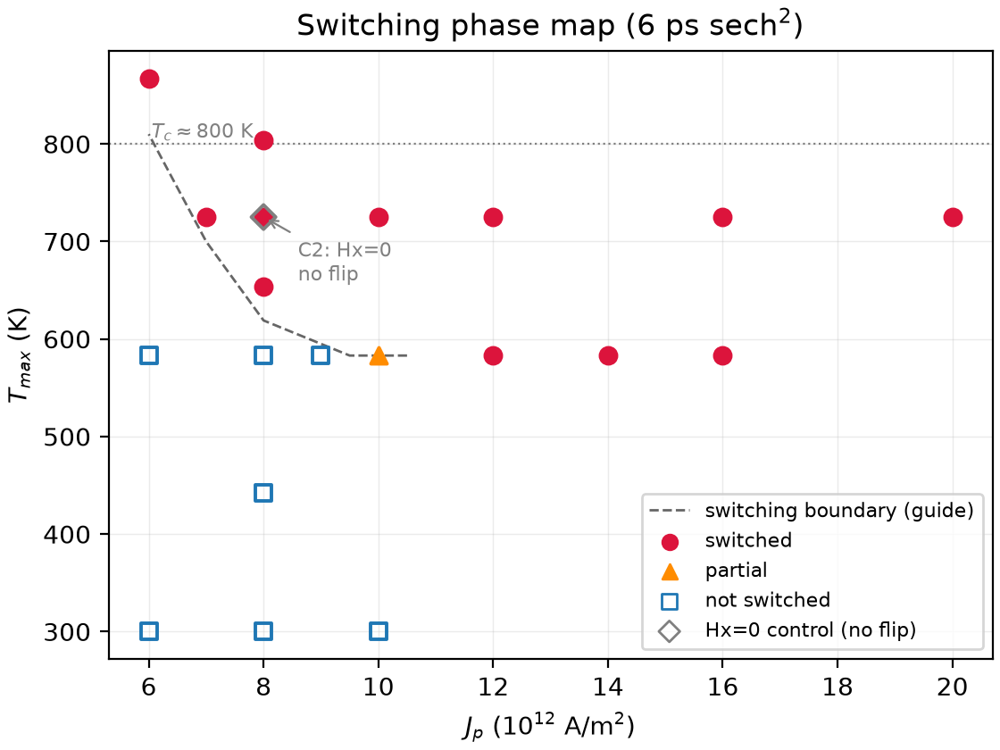
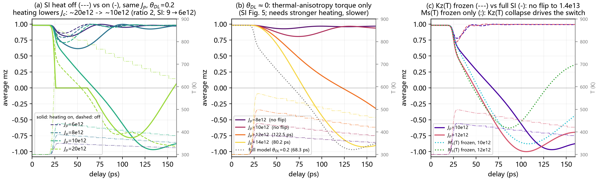
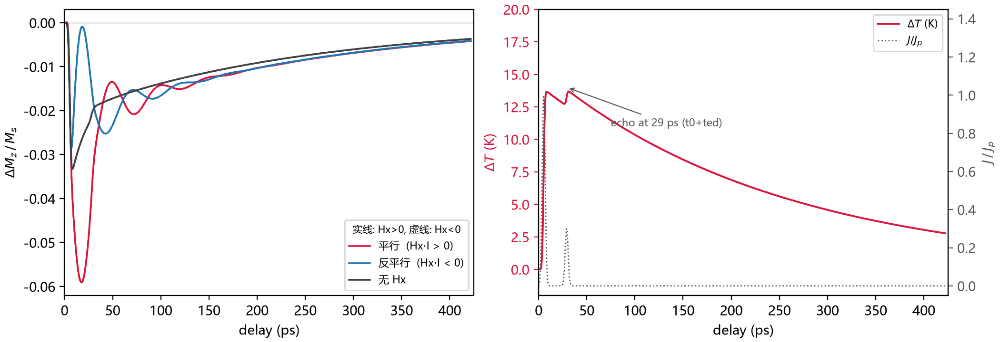
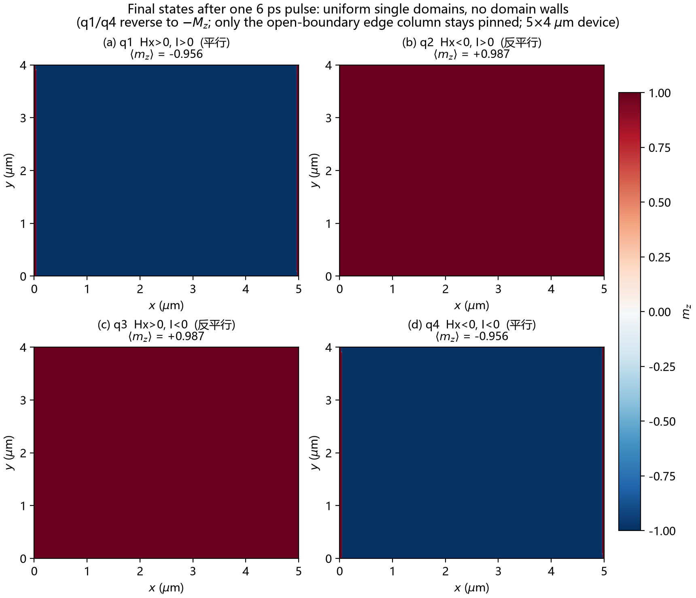

# PicoSOT

[English](README.md) | **简体中文**

**mumax3 replica: spin-orbit torque switching with picosecond electrical pulses**


用 [mumax3](https://mumax.github.io/) 复现：

> K. Jhuria, J. Hohlfeld, ... J. Gorchon,
> **"Spin-orbit torque switching of a ferromagnet with picosecond electrical pulses"**,
> *Nature Electronics* **3**, 680-686 (2020).
> doi: [10.1038/s41928-020-00488-3](https://doi.org/10.1038/s41928-020-00488-3)

器件：`Ta(5)/Pt(4)/Co(1)/Cu(1)/Ta(4)/Pt(1) nm`，Co 为垂直磁化层 (PMA)；
论文关键参数：各向异性场 `Ha ≈ 1 T`、`theta_DL = 0.20`、`theta_FL = 0.05`、
面内辅助场 `Hx = ±160 mT`、时间分辨脉冲 `3.7 ps`、翻转实验脉冲 `6 ps`、
皮秒翻转电流密度上限 `Jc ≈ 6e12 A/m^2`。

## 结果速览

|  |  |
|---|---|
| **相图**：`Jp–Tmax` 翻转边界（`plot_phase.py`） | **机制对照**：加热开/关、θ≈0、Ku(T) 冻结（`plot_mechanism.py`） |

|  |  |
|---|---|
| **Fig. 4 动力学**：6 种 Hx/I 组合 + 反射的 ΔMz(t)（`plot_fig4.py`） | **四象限**：末态均匀单畴翻转（`plot_quadrants.py`） |

---

## 1. 仓库结构

```
README.md                              # 项目说明（英文主版）
README.zh-CN.md                        # 项目说明（本文件，中文版）
FACTS.md                               # 事实清单：参数/约定/已核实结果（中文）
CITATION.cff                           # 引用元数据（GitHub「Cite this repository」）
LICENSE                                # MIT（代码）
LICENSE-docs                           # CC BY 4.0（文档）
requirements.txt                       # 后处理脚本的 Python 依赖
docs/
└─ RESULTS.md                          # 完整英文实验记录（已验证结果详情）
papers/                                # 文献（PDF 因版权不随仓库分发）
├─ README.md                           # NE 2020 / NC 2026 / AM 2023 的 DOI 列表
└─ mumax3_docs/                        # mumax3 原始论文、教程与相关文献（本地）
notes/                                 # 工作笔记；线上仅发布 error.md
└─ error.md                            # mumax3 复刻踩坑记录（已发布）
simulations/
└─ mumax3_sot/                         # 主工作目录：时间精确的脚本 + 批量结果
   ├─ fig4_dynamics.mx3                # Fig.4 动力学：PBC 无限薄膜 + 电反射 echo + RK4
   ├─ fig3_switching.mx3               # Fig.3 5×4 µm 器件单脉冲翻转（固定步长）
   ├─ macrospin_switch.mx3             # 64×64 快速翻转模板（Jp/dT_ref/KuExp/θ 旋钮）
   ├─ run_case.py                      # 批量运行+归档：runs\<tag>\{<tag>.mx3, out\}
   ├─ plot_table.py                    # table.txt → ΔMz/Ms、ΔT 曲线
   ├─ plot_phase.py                    # summary.csv → Jp–Tmax 定稿相图与边界曲线
   ├─ plot_fig4.py                     # a_f4_* → Fig.4 ΔMz(t)（平行/反平行/无 Hx）
   ├─ plot_mechanism.py                # c0/b0、b2、b3 机制对照三面板
   ├─ plot_quadrants.py                # q1–q4 m_final.ovf → 末态 2×2 面板
   ├─ energy_check.py                  # 能量核算 ∫J²dt·ρV（对标论文 <50 pJ）
   ├─ fig3_switching.out/              # Fig.3 器件参考运行输出
   ├─ fig4_dynamics.out/               # Fig.4 参考运行输出
   └─ runs/                            # 批量结果：summary.csv + 定稿图 + 各 case 的 table/log/ovf
```

* `simulations/mumax3_sot/fig4_dynamics.mx3` — 用 `SetPBC` 模拟无穷薄膜、Gaussian 脉冲、
  可叠加传输线反射，输出 `T(t)`、`J(t)`、`Ms(t)`，适合直接对照论文 Fig. 4a/4b。
* 其余中文笔记（论文翻译、交接文档、PPT 大纲等）属本地工作稿，未随仓库发布；
  已发布的踩坑记录只有 `notes/error.md`。

## 2. 快速开始

环境：Python 3.12（`pip install -r requirements.txt`）+
[mumax3](https://mumax.github.io/) v3.12（CUDA 12.9，需 NVIDIA GPU）。

```powershell
# 推荐：用 run_case.py 运行（自动归档 + 参数替换）
# mumax3 不在默认路径时：设置环境变量 MUMAX3_BIN，或加 --mumax <路径>
python simulations/mumax3_sot/run_case.py `
    simulations/mumax3_sot/macrospin_switch.mx3 b1_Jp8dT450 `
    --set Jp=8e12 J_ref=8e12 dT_ref=450
```

参数集中在 `macrospin_switch.mx3` 文件头的 **用户参数区**：

| 变量 | 含义 |
|---|---|
| `RunDynamics` | 0 = 6 ps 翻转实验；1 = 3.7 ps 时域响应 |
| `I_sign` | 电流极性，`+1` 对应论文的 `+I` |
| `InitMz` | 初始态，`+1` (up) / `-1` (down) |
| `Hx_mT` | 面内辅助场 (mT) |
| `Jp` | 电流密度峰值 (A/m²) |
| `Heating` / `dT_ref` / `J_ref` / `tau_cool` | 焦耳加热模型开关与标定参数 |
| `KuExp` | `Ku(T)=Ku0·(Ms(T)/Ms0)^KuExp`；`0` = 关闭 Ku(T)（B3 用） |
| `t_free` | 脉冲后自由演化时间 |

## 3. 两个关键约定（踩坑记录）

1. **各向异性**：mumax3 的 `Ku1` 是总单轴各向异性，需显式加上薄膜退磁场：

   ```go
   Keff  := 0.5*Ms*Ha_T                  // Ha_T 按 B 场以 T 给出；Keff = ½·Ms·Ha_T
   Ku1    = Keff + 0.5*mu0*Ms*Ms         // Ms=1.3e6, Ha=1T -> Keff=6.5e5, Ku1=1.71e6 J/m^3
   ```

   若写成 `0.5*mu0*Ms*1.0`（把 1 T 当 A/m）会得到 `Ku1 ≈ mu0*Ms²/2`，
   PMA 消失、磁化弛豫到面内，**看起来像"无法翻转"**。

2. **SOT 如何接入**：mumax3 没有原生 SOT，标准做法是用 Slonczewski 模块，
   而 `cuda/slonczewski2.cu` 内核**只读取电流密度的 z 分量**，因此：

   ```go
   FixedLayer   = vector(0, 1, 0)   // 自旋极化 sigma 沿 y（面内电流沿 x 的 SOT 几何）
   Pol          = 0.20              // = theta_DL
   EpsilonPrime = 0.05              // = theta_FL
   Lambda       = 1                 // 此时 Slonczewski 效率 eps = Pol/2，等于标准自旋霍尔因子
   J            = vector(0, 0, J_eff)
   DisableZhangLiTorque = true      // Xi 只作用于 Zhang-Li，与 SOT 无关
   ```

   写成 `J = vector(Jc, 0, 0)` 时转矩恒为零。

**极性标定**（脚本内实测，与论文 Fig. 3 一致）：

| Hx | I_sign | 终态 |
|---|---|---|
| +160 mT | +1 | −Mz |
| +160 mT | −1 | +Mz |
| −160 mT | +1 | +Mz |
| −160 mT | −1 | −Mz |

即 `sign(mz_final) = -sign(Hx·I)`（现行批量 run 均为 +Mz 初态；"与初始态无关"为论文结论，本仓库未单独跑负初态）；`Hx = 0` 时不翻转（对称性破缺必需）。

## 4. 已验证结果（2026-09-15，时间精确的 6 ps 脉冲）

> 完整英文实验记录（含全部对照与能量核算）见 [`docs/RESULTS.md`](docs/RESULTS.md)。

`macrospin_switch.mx3`（64×64、5 nm 网格，`Ms=1.3e6 A/m`、`Ha=1 T`、`alpha=0.15`、
sech² 脉冲 FWHM=6 ps，实测 5.85 ps）。能量核算（`energy_check.py`，ρ=81 µΩ cm、
V=5×4 µm²×15 nm）：**Jp=6e12 时 39.7 pJ**，与论文 40 pJ 口径一致。

**B1 翻转（J_ref=Jp，dT ∝ J²）**

| 条件 | Tmax | 平均 mz 过零 | 末态 | 能量 | 结论 |
|---|---|---|---|---|---|
| Jp=6e12, dT=300 K | 583 K | – | +0.988 | 39.7 pJ | **不翻转**（论文上限电流也不够） |
| Jp=8e12, dT=450 K | 725 K | 58.6 ps | −0.988 | 70.6 pJ | 翻转 |
| Jp=1.2e13, dT=450 K | 725 K | 50.1 ps | −0.988 | 158.9 pJ | 翻转 |
| Jp=2.0e13, dT=450 K | 725 K | **39.0 ps（最快）** | −0.988 | 441 pJ | 论文模型预测最快 16 ps，差距来自 SI 参数 |

- 四象限：`sign(mz_final) = −sign(Hx·I)`，`Hx=0` 不翻转（与论文 Fig. 3 一致，见 §3 表与 C2 对照）；
  末态面板 `runs/q_quadrants.png`（`plot_quadrants.py`）显示四个象限体内均为均匀单畴、无畴壁
  （仅开边界的边缘列被钉扎）。
- **B2 θ≈0**（`Pol=1e-4, EpsilonPrime=0`，Jp=8e12）：dT=300 K 不翻；
  dT=450/600/800 K 分别在 **85.9/92.3/122.4 ps** 翻转 → 定性复现 SI Fig. 5
  （仅靠热各向异性力矩也能翻转，但更慢、需要更强加热）。
- **B3 Ku(T) 开关**：`KuExp=0`（Ku 不随温度变）到 Jp=1.4e13 仍**不翻转**；
  `KuExp=3` 在 1e13 部分翻（末态 −0.11）、1.2e13 完全翻 → 热各向异性力矩为必要项，阈值能量比 ≥2
  （对应论文"能量降低 2 倍"）。
- **C0 Heating=0 对照**（与 `b0_6e12`/`b0_8e12`/`b1_Jp10_dT300` 同参数，仅关加热）：
  Jp=6/8/10e12 三档均**不翻转**（末态 mz≈+0.988、T 恒 300 K），峰值瞬态下拉仅
  −8.1%/−12.4%/−17.6%（相对弛豫平衡态 0.988，≈33 ps）→ 6–10e12 的确定性翻转完全依赖焦耳热致热各向异性
  力矩。目录 `runs/c0_noh_*`，对照图 `runs/heating_on_off.png`。
- **C1 相图边界中间点**（J_ref=Jp）：9e12/dT300 不翻（末态 +0.933，深度瞬态）；
  8e12/dT375 翻 66.5 ps；7e12/dT450 翻 61.0 ps；6e12/dT600 翻 80.5 ps。
  边界定位：Tmax≈583 K 线上 Jc∈(9,10]e12；Jp=8e12 竖线上 dTc∈(300,375]K；
  7e12 在 Tmax=725 K 可翻，6e12 需 Tmax≳867 K（更热更慢）。定稿图
  `runs/phase_map.png`、`runs/phase_traces.png`、`runs/phase_speed.png`
  （脚本 `plot_phase.py`；相图中的灰色菱形为 C2 `Hx=0` 对照点，不参与边界拟合）。
- **C2 对称性对照 `Hx=0`**（`runs/c2_Hx0_Jp8_dT450`，与 `b1_Jp8_dT450` 完全同参数
  `Jp=8e12`、`dT_ref=450`、`I_sign=+1`，仅 `Hx_mT=0`）：瞬态最低 mz=0.80（40.2 ps）后
  恢复，末态 **+1.0000**、无过零（`t_cross` 空，Tmax=725 K）→ 与 `Hx=+160 mT` 时
  58.6 ps 翻转形成对照，确认翻转需要 `Hx≠0` 破缺对称性。
- **机制对照总图** `runs/mechanism_compare.png`（脚本 `plot_mechanism.py`）：
  (a) c0/b0 加热开/关、(b) b2 θ≈0、(c) b3 Ku(T) 冻结三面板并排；实线/虚线为各条件的
  对照臂，同色细点划线为对应 T(t)。
- **Fig.4 动力学（含反射 `echo=0.3, ted=24 ps`，图 `runs/fig4_full.png`，脚本 `plot_fig4.py`，
  图例按 平行/反平行/无 Hx 三组）**：
  `Hx=0` 时 ±I 曲线重合且无振荡；平行组 (Hx+,I+) 与 (Hx−,I−) 重合、
  反平行组 (Hx+,I−) 与 (Hx−,I+) 重合，两组 ΔMz 相位相反（反平行组无正上冲，
  ΔMz 最低 −3.5% @31.8 ps；t=0 的 +1.3% 尖峰是表首行未弛豫态伪影）；
  T(t) 在 ~29 ps（t0+ted）处出现反射次级峰。

- **早期参考的修正重跑**（`RunDynamics=1`、3.7 ps FWHM、Jp=1e12）：`runs/dyn_Jp1e12_Ip`，
  Tmax≈308 K、mz_final=+0.9879（不翻转），与早期参考运行结论一致；开关型参考对应 `runs/b0_6e12`。

> ⚠ **历史说明**：早期自适应步长脚本的"Jp=6e12 翻转"是脉冲被拉长到 27.6 ps 的假象
> （详见 `notes/error.md` §1.11），该批旧输出已废弃删除，并按修正脚本重跑
> （开关型 `runs/b0_6e12`、动力学型 `runs/dyn_Jp1e12_Ip`）；上表为固定步长 + 真实时间
> 脉冲（`SetSolver(4)+FixDt` + `J(t)`）后的结果。

## 5. 输出与后处理

每次运行输出：

* `out/table.txt` — 列：`t, mx, my, mz, E_total, J, T`（时间单位 s、J 单位 A/m²、T 单位 K；
  fig3/fig4 脚本无 `E_total`，以 `Ms`(A/m) 列代替）
* `out/m_*.ovf` — 磁化分布快照（`OVF2_BINARY`）
* `out/log.txt` — 控制台日志，含 relax/脉冲后的平均 mz

```python
import pandas as pd
df = pd.read_csv("out/table.txt", sep="\t")
df.columns = [c.lstrip("# ").strip() for c in df.columns]
df["t_ps"] = df["t (s)"] * 1e12
```

```powershell
mumax3-convert -png out/m_final.ovf      # 快速出图
mumax3-convert -vtk out/m_final.ovf      # 给 ParaView
```

参数扫描（示例：翻转阈值 vs Jp，`J_ref=Jp` 即 `dT ∝ J²`）：

```powershell
foreach ($Jp in "6e12","8e12","1.2e13") {
    python simulations/mumax3_sot/run_case.py `
        simulations/mumax3_sot/macrospin_switch.mx3 "b1_Jp$Jp" `
        --set "Jp=$Jp" "J_ref=$Jp" dT_ref=450
}
# 每次运行自动写入 runs/summary.csv（tag、t_cross_ps、recov_50ps、mz_final ...）
```

## 6. 仿真路线

1. **自检**：`relax` 后 `mz ≈ cos[atan(Hx/Ha)] ≈ 0.988`；确认 `Hx=0` 不翻转、电流极性反转终态、关闭加热时 6/8/10e12 均不翻转（`runs/c0_noh_*`）。
2. **时域动力学（Fig.4a,b）**：`RunDynamics=1`（或 `fig4_dynamics.mx3`），
   6 种 Hx/I 组合（Hx∈{0,±160 mT} × I±，均从 +Mz 初态出发），画 `ΔMz(t)`；
   无 Hx 时振荡消失，±电流相位差 180°。
3. **单脉冲翻转（Fig.3/4d）**：`macrospin_switch.mx3`（或全器件 `fig3_switching.mx3`），
   `RunDynamics=0`；6 ps 真实脉冲下：`Tmax≈583 K` 线上 `Jc∈(9,10]e12`，`dT=450 K` 时 `7e12` 已可翻（C1），
   四象限已批量验证（`runs/q1–q4`、`runs/a_f4_*`）；扫描 Hx 可定性复现 `Jc ∝ 1/Hx`。
4. **热模型标定**：本仓库的加热模型是唯象模型（`dT ∝ J²` 低通 + `Ms(T)`/`Ku(T)` 标度律，
   `Tc=800 K`）。标定目标：低电流退磁 1–2%、脉冲后恢复 ~300–400 ps。
   mumax3 的 `Temp` 只加 Langevin 噪声、不缩放 `Ms/Ku`，所以这里用脚本逐步修改 `Msat`、`Ku1`。
5. **微磁与概率（选做）**：切到 1024×800（5×4 µm 器件）+ Voronoi 晶粒各向异性扰动，
   统计不同随机种子下的 `P_sw(Jp)`，对应论文的 >91% 翻转概率和成核图像。
6. **能耗估计**：`python simulations/mumax3_sot/energy_check.py runs/<tag>`
   直接对 table 里的真实 `J(t)` 积分（`rho=81 µΩ cm`、`V=5×4 µm²×15 nm`）；
   6e12/6 ps → 39.7 pJ（与论文口径一致）；本模型能翻转的案例能量 39.7–441 pJ
   （54.1 pJ @7e12/dT450；39.7 pJ @6e12/dT600，Tmax=867 K > Tc，接近论文排除的 HAMR 情形）。

## 7. 已知局限

* 早期自适应步长版本的输出（脉冲被拉长到 ~28 ps，`notes/error.md` §1.11）**已废弃删除**，等效案例已用修正脚本重跑（开关型 `runs/b0_6e12`、动力学型 `runs/dyn_Jp1e12_Ip`）；现结论全部来自修正后的脚本；
* `macrospin_switch.mx3` / `fig3_switching.mx3` 为均匀 Ku 模型，未含成核/畴壁与随机性；
* 加热为唯象模型（`dT ∝ J²` 低通 + `Ms(T)/Ku(T)` 标度律），精确拟合应以论文 SI 为准；
* 传输线反射（echo）在 `fig4_dynamics.mx3` 中以叠加延迟脉冲近似；
* 论文的准静态 `Jc(Hx)`（100 µs 脉冲）依赖热激活，不适合直接长时间 LLG 复现。

## 8. 引用

若使用本仓库，请引用原论文与 mumax3（`CITATION.cff` 已收录以下条目，GitHub 右上角
「Cite this repository」可直接导出）：

* doi:10.1038/s41928-020-00488-3
* A. Vansteenkiste et al., *AIP Advances* **4**, 107133 (2014).

## 9. 许可

* **代码**（`simulations/` 下的 `.py` / `.mx3`、`requirements.txt`）：MIT，见 [`LICENSE`](LICENSE)；
* **文档**（README、`FACTS.md`、`docs/`、`notes/error.md`）：CC BY 4.0，见 [`LICENSE-docs`](LICENSE-docs)；
* `papers/` 中的文献 PDF 版权归原作者与期刊所有，**不随本仓库分发**，不在上述许可范围内。
